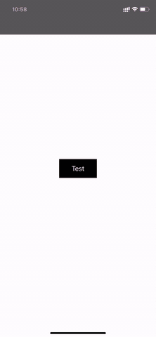

# Rounded Irregular Shape

How to draw irregular shapes easily?

- Convert irregular shapes into SVG image
- Parse SVG image to UIBeizerPath(via [PocketSVG](https://github.com/pocketsvg/PocketSVG))
- Create ShapeLayer with UIBeizerPath

How to add rounded corners to irregular shapes？

- Parse (CGPoint, CGPathElementType) from CGPath
- Caculate radius for each line type points
- Add arc to these points
- Integrate all to generate new UIBeizerPath

Done!

For more details please run DEMO project.